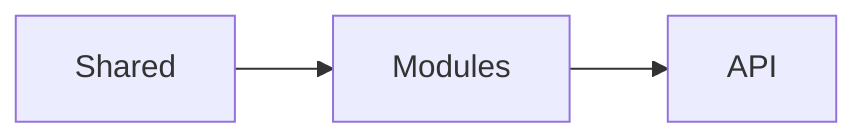
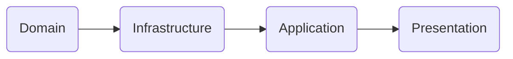
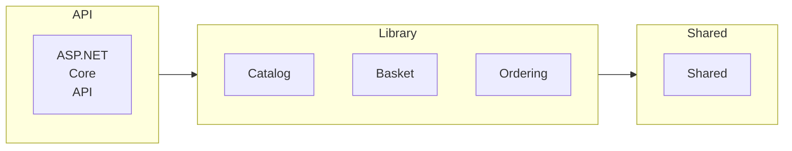

# modularBasket
modular monoliths architecture
.NET 8
.NET SDK 8.0.4
.NET runtime 8.0.8

# Create Project

```cs
mkdir src
dotnet new web -n API -o src/Bootstrapper/API
dotnet new classlib -n Catalog -o src/Modules/Catalog/Catalog
dotnet new classlib -n Basket -o src/Modules/Basket/Basket
dotnet new classlib -n Ordering -o src/Modules/Ordering/Ordering
dotnet new classlib -n Shared -o src/Shared/Shared

dotnet new sln -n modulear-basket -o src
cd src
dotnet sln add Bootstrapper/API
dotnet sln add Modules/Catalog/Catalog
dotnet sln add Modules/Basket/Basket
dotnet sln add Modules/Ordering/Ordering
dotnet sln add Shared/Shared

dotnet add Bootstrapper/API/API.csproj reference Modules/Catalog/Catalog/Catalog.csproj
dotnet add Bootstrapper/API/API.csproj reference Modules/Basket/Basket/Basket.csproj
dotnet add Bootstrapper/API/API.csproj reference Modules/Ordering/Ordering/Ordering.csproj

dotnet add Modules/Catalog/Catalog/Catalog.csproj reference Shared/Shared/Shared.csproj
dotnet add Modules/Basket/Basket/Basket.csproj reference Shared/Shared/Shared.csproj
dotnet add Modules/Ordering/Ordering/Ordering.csproj reference Shared/Shared/Shared.csproj

dotnet new class -n CatalogModule -o Modules/Catalog/Catalog
dotnet new class -n BasketModule -o Modules/Basket/Basket
dotnet new class -n OrderingModule -o Modules/Ordering/Ordering
dotnet new class -n GlobalUsings -o Bootstrapper/API


// package
dotnet add Shared/Shared/Shared.csproj package Microsoft.Extensions.DependencyInjection.Abstractions
dotnet add Shared/Shared/Shared.csproj package Microsoft.Extensions.Configuration.Abstractions
dotnet add Shared/Shared/Shared.csproj package FluentValidation.AspNetCore
dotnet add Shared/Shared/Shared.csproj package MediatR

```

# Technical Analysis





## Shared Library

* Domain Drive Design DDD

```cs
// Entity
dotnet new interface -n IEntity -o Shared/Shared/DDD
dotnet new class -n Entity -o Shared/Shared/DDD
// Domain Event
dotnet new interface -n IDomainEvent -o Shared/Shared/DDD
// Aggregate
dotnet new interface -n IAggregate -o Shared/Shared/DDD
dotnet new class -n Aggregate -o Shared/Shared/DDD

```
