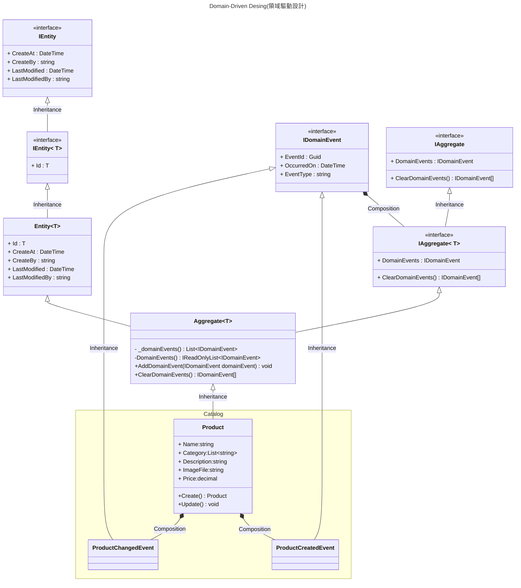

# modularBasket
modular monoliths architecture
.NET 8
.NET SDK 8.0.4
.NET runtime 8.0.8

# Create Project

```cs
mkdir src
dotnet new web -n API -o src/Bootstrapper/API
dotnet new classlib -n Catalog -o src/Modules/Catalog/Catalog
dotnet new classlib -n Basket -o src/Modules/Basket/Basket
dotnet new classlib -n Ordering -o src/Modules/Ordering/Ordering
dotnet new classlib -n Shared -o src/Shared/Shared
dotnet new classlib -n Catalog.Contracts -o src/Modules/Catalog/Catalog.Contracts
dotnet new classlib -n Shared.Contracts -o src/Shared/Shared.Contracts
dotnet new classlib -n Shared.Messaging -o src/Shared/Shared.Messaging

dotnet new sln -n modulear-basket -o src
cd src
dotnet sln add Bootstrapper/API
dotnet sln add Modules/Catalog/Catalog
dotnet sln add Modules/Basket/Basket
dotnet sln add Modules/Ordering/Ordering
dotnet sln add Shared/Shared
dotnet sln add Shared/Shared.Messaging

dotnet add Bootstrapper/API/API.csproj reference Modules/Catalog/Catalog/Catalog.csproj
dotnet add Bootstrapper/API/API.csproj reference Modules/Basket/Basket/Basket.csproj
dotnet add Bootstrapper/API/API.csproj reference Modules/Ordering/Ordering/Ordering.csproj

dotnet add Modules/Catalog/Catalog/Catalog.csproj reference Modules/Catalog/Catalog.Contracts/Catalog.Contracts.csproj
dotnet add Modules/Catalog/Catalog/Catalog.csproj reference Modules/Catalog/Catalog.Contracts/Catalog.Contracts.csproj
dotnet add Modules/Catalog/Catalog/Catalog.csproj reference Shared/Shared.Messaging/Shared.Messaging.csproj

dotnet add Modules/Basket/Basket/Basket.csproj reference Shared/Shared/Shared.csproj
dotnet add Modules/Basket/Basket/Basket.csproj reference Modules/Catalog/Catalog.Contracts/Catalog.Contracts.csproj
dotnet add Modules/Basket/Basket/Basket.csproj reference Shared/Shared.Messaging/Shared.Messaging.csproj

dotnet add Modules/Ordering/Ordering/Ordering.csproj reference Shared/Shared/Shared.csproj

dotnet add Shared/Shared/Shared.csproj reference Shared/Shared.Contracts/Shared.Contracts.csproj
dotnet add Modules/Catalog/Catalog.Contracts/Catalog.Contracts.csproj reference Shared/Shared.Contracts/Shared.Contracts.csproj


dotnet new class -n CatalogModule -o Modules/Catalog/Catalog
dotnet new class -n BasketModule -o Modules/Basket/Basket
dotnet new class -n OrderingModule -o Modules/Ordering/Ordering
dotnet new class -n GlobalUsings -o Bootstrapper/API


// package
dotnet add Shared/Shared/Shared.csproj package Microsoft.Extensions.DependencyInjection.Abstractions
dotnet add Shared/Shared/Shared.csproj package Microsoft.Extensions.Configuration.Abstractions
dotnet add Shared/Shared/Shared.csproj package FluentValidation.AspNetCore
dotnet add Shared/Shared/Shared.csproj package MediatR
dotnet add Shared/Shared/Shared.csproj package Microsoft.EntityFrameworkCore
dotnet add Shared/Shared/Shared.csproj package Microsoft.EntityFrameworkCore.Design
dotnet add Shared/Shared/Shared.csproj package Npgsql.EntityFrameworkCore.PostgreSQL
dotnet add Shared/Shared/Shared.csproj package Mapster
dotnet add Shared/Shared/Shared.csproj package Carter
dotnet add Shared/Shared/Shared.csproj package FluentValidation.DependencyInjectionExtensions
dotnet add Shared/Shared/Shared.csproj package Microsoft.Extensions.Caching.StackExchangeRedis
dotnet add Shared/Shared/Shared.csproj package Scrutor // decoration pattern

// API Nuget
dotnet add Bootstrapper/API/API.csproj package Serilog.AspNetCore
dotnet add Bootstrapper/API/API.csproj package Serilog.Sinks.Seq

// Share Contracts Nuget
dotnet remove Shared/Shared/Shared.csproj package MediatR
dotnet add Shared/Shared.Contracts/Shared.Contracts.csproj package MediatR


// Share Messaging Nuget
dotnet add Shared/Shared.Messaging/Shared.Messaging.csproj package MassTransit


// API package
dotnet add Bootstrapper/API/API.csproj package Microsoft.EntityFrameworkCore.Design
dotnet add Bootstrapper/API/API.csproj package Keycloak.AuthServices.Authentication

```

# Technical Analysis


## Shared Library

* Domain Drive Design DDD

```cs
// Entity
dotnet new interface -n IEntity -o Shared/Shared/DDD
dotnet new class -n Entity -o Shared/Shared/DDD
// Domain Event
dotnet new interface -n IDomainEvent -o Shared/Shared/DDD
// Aggregate
dotnet new interface -n IAggregate -o Shared/Shared/DDD
dotnet new class -n Aggregate -o Shared/Shared/DDD

```

---
## Catalog Module

* Application Architecture = Vertical Slice Archiecture
* Patterns & Principles
    1. CQRS Pattern
    2. Mediator Pattern
    3. DI
    4. Minimal APIs and Routing in ASP.NET 8
    5. ORM Pattern
* Libraries Nuget Packages
    1. MediatR for CQRS
    2. Carter for API Endpoints
    3. EF Core for PostgreSQL
    3. Mapster for Object Mapping
    4. FluentValidation for Input Validation
* Project Folder Structure
    ```cs
    dotnet new class -n GlobalUsings -o Modules/Caftalog/Catalog

    // Product
    dotnet new class -n Product -o Modules/Catalog/Catalog/Products/Models
    dotnet new class -n ProductCreatedEvent -o Modules/Catalog/Catalog/Products/Events
    dotnet new record -n ProductChangedEvent -o Modules/Catalog/Catalog/Products/Events
    //Data
    dotnet new class -n CatalogDbContext -o Modules/Catalog/Catalog/Data
    dotnet new class -n ProductConfiguration -o Modules/Catalog/Catalog/Data/Configurations

    // EF
    dotnet ef migrations add InitialCreate
    dotnet ef database update
    ```


# Database
```cs
// Catalog
dotnet ef migrations add InitialCreate -o Data/Migrations -p Modules/Catalog/Catalog -s Bootstrapper/API
dotnet ef database update -p Modules/Catalog/Catalog -s Bootstrapper/API

// Basket
dotnet ef migrations add InitialCreate --context BasketDbContext -o Data/Migrations -p Modules/Basket/Basket -s Bootstrapper/API
dotnet ef database update --context BasketDbContext -p Modules/Basket/Basket -s Bootstrapper/API

// Ordering
dotnet ef migrations add InitialCreate --context OrderingDbContext -o Data/Migrations -p Modules/Ordering/Ordering -s Bootstrapper/API
dotnet ef database update --context OrderingDbContext -p Modules/Ordering/Ordering -s Bootstrapper/API

```

## Identity Database
```shell
# 登入
psql -U postgres -d basketdb  -h localhost -p 5432
# 建 schema : https://www.cnblogs.com/weaming/p/postgre-basic.html
CREATE SCHEMA identity;
GRANT ALL ON SCHEMA identity TO postgres;
```


 

# Class 

## Domain-Driven Desing




## CQRS Command Query Responsibility Segregation (MediatR)


# Keycloak
https://nikiforovall.github.io/aspnetcore/dotnet/2022/08/24/dotnet-keycloak-auth.html